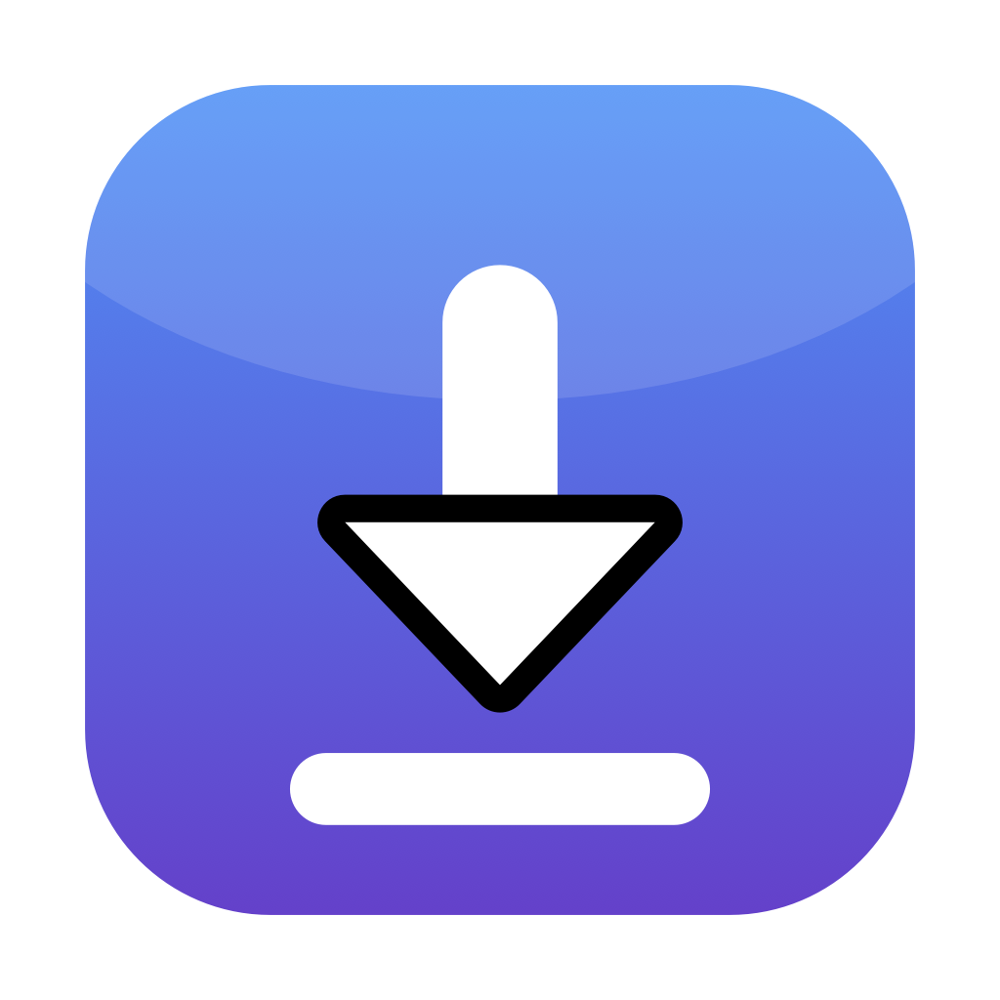
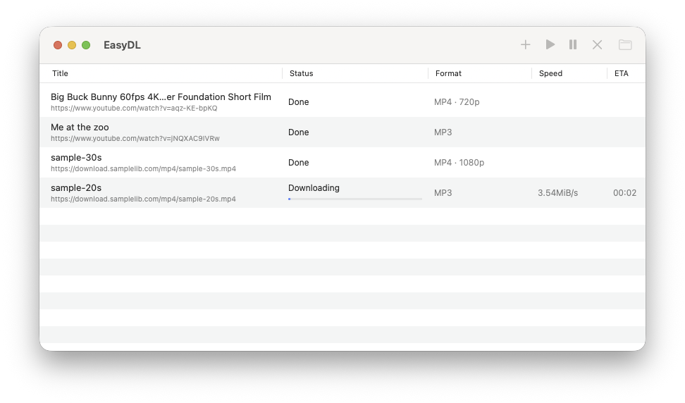
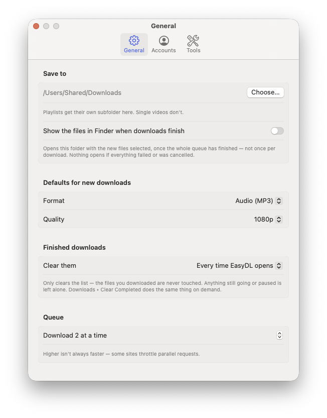

# EasyDL — a native macOS GUI for yt-dlp

**Download YouTube videos and playlists as MP4 or MP3 from a real Mac app.** EasyDL is
a free, open-source, native macOS front end for [yt-dlp][ytdlp] — written in SwiftUI,
not Electron, not a web wrapper. Paste a batch of links, pick a format and a quality
ceiling, and it downloads them with a proper queue, a real menu bar, and drag and drop.

[](LICENSE)


[](https://github.com/gulfvideo/EasyDL/releases/latest)

**[Download the latest release](https://github.com/gulfvideo/EasyDL/releases/latest)** —
universal (Apple silicon and Intel), macOS 14+. It is ad-hoc signed rather than
notarized, so macOS blocks it on first launch; the [release notes][rel] say how to get
past that, and [building from source](#install) avoids it entirely.

[rel]: https://github.com/gulfvideo/EasyDL/releases/latest

- **Batch downloads** — paste as many URLs as you like, one per line
- **MP4 or MP3** — video with a resolution cap, or audio extracted to MP3
- **Playlists and channels** — expanded automatically into a numbered folder
- **Queue control** — pause, resume, cancel, retry; 1–6 downloads at a time
- **Resumes interrupted downloads** instead of starting over
- **Sign-in support** — for age-restricted, members-only and private videos
- **1000+ sites**, not just YouTube — anything yt-dlp supports

<p align="center">
  
</p>

---

## Contents

- [Install](#install)
- [Using it](#using-it)
- [Signing in (cookies)](#signing-in-cookies)
- [PO token provider](#po-token-provider)
- [Keyboard shortcuts](#keyboard-shortcuts)
- [FAQ](#faq)
- [Troubleshooting](#troubleshooting)
- [How it works](#how-it-works)
- [Tests](#tests)
- [Not included](#not-included)

## Install

Either [download the release](https://github.com/gulfvideo/EasyDL/releases/latest) or
build it — building takes about ten seconds and sidesteps the Gatekeeper warning.

EasyDL needs [yt-dlp][ytdlp] and [ffmpeg][ffmpeg]. It does **not** bundle them, so
`brew upgrade yt-dlp` is all it takes to keep up when YouTube changes something —
which happens every few weeks.

```bash
brew install yt-dlp ffmpeg
git clone https://github.com/gulfvideo/EasyDL.git
cd EasyDL
./build.sh
open build/EasyDL.app
```

`build.sh` compiles, runs the test suite, assembles the bundle and ad-hoc signs it.
Install it for good with `cp -R build/EasyDL.app /Applications/`.

Requires macOS 14 or later and the Xcode command line tools. Builds for whichever
architecture your Mac is (Apple silicon or Intel).

Optional, and worth it if you download audio from YouTube:

```bash
./install-pot-provider.sh
```

See [PO token provider](#po-token-provider).

## Using it

Press **⌘N**, paste your links one per line, choose **Video (MP4)** or **Audio (MP3)**
and a quality ceiling, and hit Add. You can also drag a link straight from Safari onto
the window, or press **⇧⌘V** to add whatever is on the clipboard.

- **Playlists** go into a folder named after the playlist, numbered in order. Single
  videos stay flat in your download folder.
- **Quality** is a hard ceiling — ask for 720p and you get 720p or below, never 1080p.
  "Best available" takes the highest the site offers.
- **MP3** downloads the audio stream only; no video is fetched at all in the normal
  case. Quality is whatever the source provides — MP3 can't add detail that isn't there.
- **Show in Finder when done** (Settings → General, off by default) opens the download
  folder with the new files selected once the *whole queue* finishes, not once per
  download.
- **Tidying up** — finished rows are cleared each time EasyDL opens. Settings → General
  changes that to keeping them, or dropping them after a day, a week or a month. It only
  clears the list; your files are never touched.

<p align="center">
  
</p>

Interrupted downloads resume rather than restart: the queue is saved across launches and
yt-dlp continues from the partial file. Quitting mid-download asks first.

## Signing in (cookies)

YouTube refuses most anonymous requests now — *"Sign in to confirm you're not a bot"* —
so cookies are effectively required. Two ways, in **Settings → Accounts**:

### A cookie file (recommended)

A `cookies.txt` export. It needs no macOS privacy grant, survives app rebuilds, and
isn't invalidated when the browser rotates your session. Export it once:

```bash
yt-dlp --cookies-from-browser safari --cookies ~/Documents/yt-cookies.txt --simulate https://www.youtube.com
```

That command needs Full Disk Access on whatever runs it — grant it to Terminal once, or
use a "Get cookies.txt" browser extension instead. Then point Settings → Accounts at the
file.

The export contains cookies for **every site you've visited**. Trim it to the ones you
need, and don't share it:

```bash
grep -E '^#|youtube|google' ~/Documents/yt-cookies.txt > ~/Documents/yt-cookies-youtube.txt
```

### Reading a browser directly

Simpler, but macOS gates access to browser profiles and the grant is tied to the app's
code signature — so it resets every time you rebuild EasyDL. Chromium-based browsers
must also be quit first, because they lock their cookie database while running.

## PO token provider

YouTube's audio-only formats (140, 251) answer **HTTP 403 Forbidden** to a full request
unless the caller can mint a PO token. A small range request still succeeds, which makes
it look intermittent when it isn't. Cookies don't help — the page loads fine, only the
media URL is refused.

`./install-pot-provider.sh` installs [bgutil-ytdlp-pot-provider][bg] (third-party, needs
[Node][node]) in two pieces: a yt-dlp plugin in `~/.config/yt-dlp/plugins/`, and a
generator under `~/Library/Application Support/EasyDL/pot-provider/`. EasyDL finds it
automatically; Settings → Tools shows whether it's installed. Remove it with
`./install-pot-provider.sh --remove`.

Measured on a 3 hour 50 minute recording:

| | fetched | result |
|---|---|---|
| with the provider | **173 MiB**, audio only, 3s | complete |
| without it | 972 MiB of 360p video, discarded after extraction | complete |
| without it, smallest rung | 223 MiB | **broken** — 2352/2608 fragments dropped, 21 min of audio, exit code 0 |

Two details worth knowing. The plugin goes in yt-dlp's plugin folder rather than being
`pip install`ed, because Homebrew's yt-dlp is a virtualenv that `brew upgrade` replaces.
And it runs in *script* mode rather than as an HTTP server: nothing sits in the
background, no port to collide with, nothing to restart after a reboot.

### The 403 fallback

Still there as a safety net, for when no provider is installed or a token can't be
minted. On a 403 EasyDL retries the item once against the `web_safari` player client and
sorts with `-S proto,abr,+size` — `proto` first, which prefers the single progressive
file over the HLS ladder.

That looks wasteful and isn't: the smaller fragmented rungs drop fragments on long
videos, and **yt-dlp skips unavailable fragments and still exits 0**, so the result is a
short file that looks perfectly valid. EasyDL passes `--abort-on-unavailable-fragments`
on every download so that fails loudly instead. Every rung carries the same audio
(~128 kbps AAC), so taking the larger stream costs bytes and nothing else.

Client choice is deliberately not pinned per format: `tv` also serves the progressive
file and worked one day, then began failing extraction outright the next. Sorting by
protocol survives that; naming a client does not.

## Keyboard shortcuts

| | |
|---|---|
| ⌘N | Add URLs |
| ⇧⌘V | Add from clipboard |
| ⇧⌘O | Open downloads folder |
| ⌘R | Resume |
| ⇧⌘P | Pause |
| ⌘. | Cancel |
| ⌥⌘R | Retry |
| ⇧⌘R | Reveal in Finder |
| ⌫ | Remove from list |

Toolbar and menu commands act on the selection, or on the whole queue when nothing is
selected.

## FAQ

**Is there a GUI for yt-dlp on macOS?**
Yes — this is one. EasyDL is a native SwiftUI app that drives yt-dlp for you, so you get
a queue, a menu bar, drag and drop and Finder integration instead of a terminal.

**Is it free and open source?**
Yes, MIT licensed. No ads, no telemetry, no account, no bundled installer junk.

**Does it work on Apple silicon and Intel Macs?**
Yes. It builds for whichever Mac you compile it on, and finds Homebrew in both
`/opt/homebrew` and `/usr/local`.

**Can it download a whole YouTube playlist or channel?**
Yes. Paste the playlist or channel URL and yt-dlp expands it. Entries land in a folder
named after the playlist, numbered in order.

**Can it convert YouTube to MP3?**
Yes. Choose Audio (MP3); ffmpeg extracts the audio at the best quality the source
carries. In the normal case only the audio stream is downloaded, not the video.

**Do I need Docker?**
No. The optional PO token provider needs Node, not Docker, and runs on demand rather
than as a server.

**Does it bundle yt-dlp?**
No, deliberately. It uses the copy Homebrew installed, so `brew upgrade yt-dlp` keeps you
current when a site changes. If yt-dlp is missing, EasyDL says so in a banner instead of
failing silently.

**Does it work with sites other than YouTube?**
Yes — anything [yt-dlp supports][sites], which is over a thousand sites. The
YouTube-specific pieces (the PO token provider, the 403 fallback) only engage on YouTube
hosts.

**Why does macOS say it can't verify the developer?**
The build is ad-hoc signed, which is enough to run on the Mac that built it. It isn't
notarized, because that needs a paid Apple Developer account. Build from source and you
won't see the warning.

**Is it a Mac-assed Mac app?**
That's the aim: real menu bar commands, keyboard shortcuts, drag and drop, contextual
menus, Finder integration, saved window state, and a quit warning when downloads are
running.

## Troubleshooting

Error messages below are what yt-dlp actually prints. EasyDL recognises each of these and
explains it in the app rather than just showing the raw text.

**`Sign in to confirm you're not a bot`**
YouTube refused an anonymous request. Set up [cookies](#signing-in-cookies).

**`HTTP Error 403: Forbidden` on audio-only downloads**
YouTube's DASH audio formats need a PO token. Install the
[PO token provider](#po-token-provider), or let the built-in fallback handle it.

**`Operation not permitted: .../Cookies.binarycookies`**
macOS blocks reading Safari's cookies without Full Disk Access. Grant it, or use a cookie
file instead.

**`could not find chrome cookies database`**
macOS blocked access to Chrome's profile folder. That grant resets whenever the app is
rebuilt — use a cookie file instead, which needs no permission at all.

**`Could not copy Chrome cookie database`**
Quit Chrome completely; Chromium browsers lock the file while running.

**A download finished but the file is much shorter than the video**
That's fragments being dropped silently. EasyDL passes
`--abort-on-unavailable-fragments` specifically so this fails loudly instead — if you see
it from yt-dlp directly, add that flag.

## How it works

EasyDL builds a yt-dlp command line and runs it as a subprocess, parsing progress back
out of a custom `--progress-template`. It doesn't reimplement any downloading. The app is
a queue, a UI and a set of careful defaults on top of yt-dlp:

- `--ignore-config`, so your `~/.config/yt-dlp/config` can't change the GUI's behaviour
- `--abort-on-unavailable-fragments`, so a lossy transfer fails instead of truncating
- `--continue`, so a cancelled download resumes
- a hard `height<=N` format filter rather than a sort preference, so a quality ceiling
  is actually a ceiling

Source layout: `Sources/EasyDL/Model.swift` holds the argument builder and output
parsers (all pure functions), `DownloadQueue.swift` runs the processes, and the rest is
SwiftUI.

## Tests

Two layers. The offline one runs on every build; the other does real downloads.

```bash
./build.sh              # compiles, then runs ~455 offline checks
Tests/e2e.sh            # real downloads, a couple of minutes
Tests/e2e.sh --long     # also the 403 fallback case (~1GB)
```

**Offline** covers what gets pulled out of a paste, which yt-dlp arguments each format
and quality choice produces, cookie precedence, when the 403 fallback engages, how each
real failure is explained, which finished rows a cleanup policy removes, and whether a
queue saved by an older build still loads.

**End-to-end** drives real downloads through the app's own argument builder, so it
exercises shipping code rather than a copy: plain download, MP3, batch, awkward folder
names, duplicate detection, resume, dead links, playlist naming, quality caps, signed-out
behaviour, the PO token provider, and the 403 fallback. The resume case runs against
`Tests/rangeserver.py`, a local server that honours HTTP Range and logs what was asked
for — public test hosts answer a ranged request with the whole file, which makes resume
impossible to observe.

## Not included

Metadata, thumbnail and subtitle embedding; clipboard auto-watching; a built-in yt-dlp
updater; notarized release builds. Contributions welcome.

## Security

See [SECURITY.md](SECURITY.md). Briefly: arguments are passed as an argv array (never a
shell), URLs come after a `--` separator so they cannot be read as options, double-click
only opens media extensions because the server picks the extension, playlist folder
names are guarded against `..`, and `PYTHON*` variables are stripped from the child
environment. The app is not sandboxed and not notarized, deliberately.

## Legal

EasyDL is a front end for yt-dlp. Download only what you have the right to download, and
respect the terms of the sites you use it on.

## License

MIT — see [LICENSE](LICENSE).

[ytdlp]: https://github.com/yt-dlp/yt-dlp
[ffmpeg]: https://ffmpeg.org
[bg]: https://github.com/Brainicism/bgutil-ytdlp-pot-provider
[node]: https://nodejs.org
[sites]: https://github.com/yt-dlp/yt-dlp/blob/master/supportedsites.md
